# Torua Architecture Documentation

## Table of Contents

1. [System Overview](#system-overview)
2. [Core Design Principles](#core-design-principles)
3. [System Components](#system-components)
4. [Coordinator Architecture](#coordinator-architecture)
5. [Node/Shard Architecture](#nodeshard-architecture)
6. [Communication Protocol](#communication-protocol)
7. [Data Distribution Strategy](#data-distribution-strategy)
8. [Query Execution Model](#query-execution-model)
9. [Fault Tolerance & Recovery](#fault-tolerance--recovery)
10. [Scaling Strategy](#scaling-strategy)
11. [Implementation Roadmap](#implementation-roadmap)

## System Overview

Torua is a distributed GraphRAG system that combines the architectural simplicity of Elasticsearch with the power of embedded graph databases. The system is designed to horizontally scale graph storage and computation across multiple nodes while maintaining consistency and fault tolerance.

### High-Level Architecture

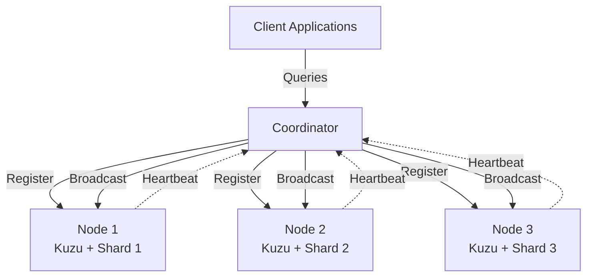

### Component Responsibilities

| Component | Primary Responsibilities | Secondary Responsibilities |
|-----------|-------------------------|---------------------------|
| Coordinator | Cluster topology, Query routing | Health monitoring, Metadata management |
| Node | Graph storage, Local query execution | Replication, Recovery |
| Client | Query submission, Result processing | Connection pooling, Retry logic |

## Core Design Principles

### 1. Simplicity Over Complexity
Every architectural decision favors simple, understandable solutions over complex optimizations. The codebase should be readable by junior engineers.

### 2. Distributed First
The system assumes multiple nodes from the start. There is no "single-node mode" - even a single node runs through the full distribution logic.

### 3. Eventual Consistency
The system favors availability and partition tolerance over strict consistency (AP in CAP theorem). Graph operations are eventually consistent.

### 4. Locality of Reference
Related graph data is co-located on the same shard whenever possible to minimize cross-shard communication during traversals.

### 5. Fail-Fast with Graceful Degradation
Components fail quickly when errors occur but the system continues operating with reduced capacity rather than complete failure.

## System Components

### Component Interaction Flow

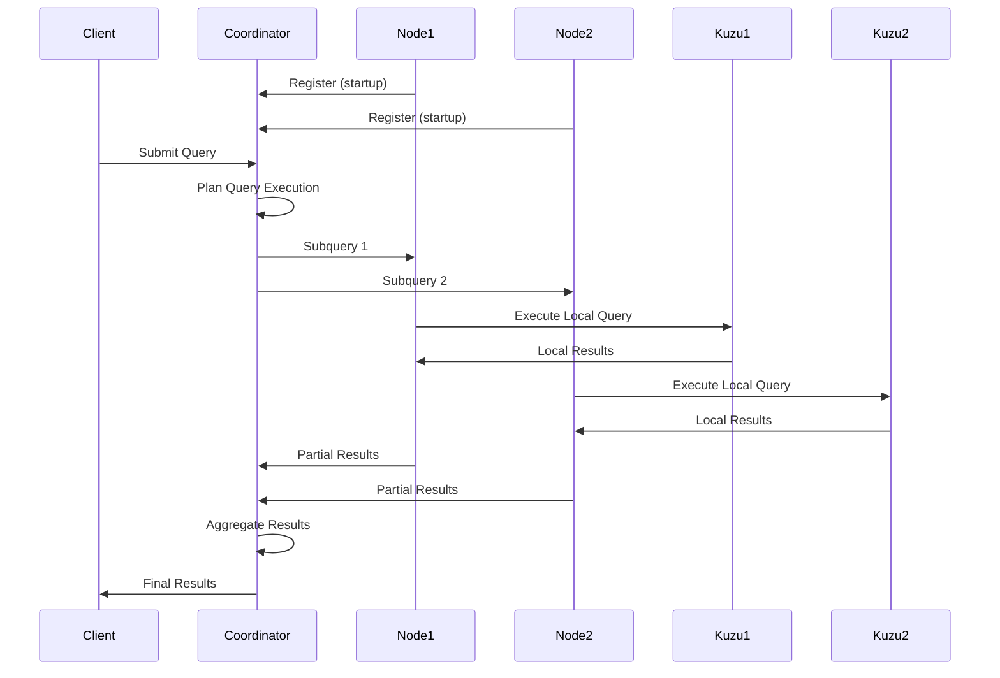

## Coordinator Architecture

The Coordinator is the orchestration layer of the cluster, responsible for maintaining global state and coordinating distributed operations.

### Core Responsibilities

#### 1. Cluster Topology Management
```go
// Maintained in-memory state
type ClusterState struct {
    nodes    map[string]*NodeInfo  // Active nodes
    shards   map[int]*ShardInfo    // Shard assignments
    replicas map[int][]string      // Replica locations
    version  uint64                 // Cluster version for consistency
}
```

The coordinator maintains the authoritative view of:
- Which nodes are active
- How shards are distributed
- Where replicas are located
- Current cluster topology version

#### 2. Query Planning & Routing

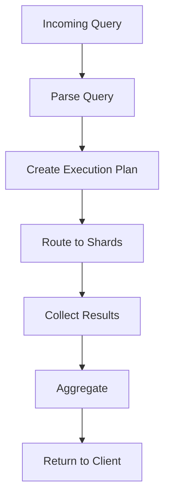

The coordinator:
- Parses incoming graph queries
- Determines which shards contain relevant data
- Creates optimized execution plans
- Routes subqueries to appropriate nodes
- Aggregates partial results

#### 3. Health Monitoring

```go
// Health monitoring loop (pseudo-code)
func (c *Coordinator) monitorHealth() {
    ticker := time.NewTicker(5 * time.Second)
    for range ticker.C {
        for _, node := range c.nodes {
            if err := node.CheckHealth(); err != nil {
                c.handleNodeFailure(node)
            }
        }
    }
}
```

#### 4. Metadata Management

The coordinator maintains cluster-wide metadata:
- Graph schemas
- Index definitions
- Shard routing tables
- Replication policies
- Access control lists

### Coordinator Internal Architecture

```
Coordinator/
├── HTTP Server         # API endpoints
├── Cluster Manager     # Node registration, topology
├── Query Planner      # Query optimization, planning
├── Router             # Request routing
├── Aggregator         # Result aggregation
├── Health Monitor     # Node health checks
├── Metadata Store     # Cluster metadata
└── Broadcast Manager  # Control message distribution
```

### Failure Handling

The coordinator implements several failure handling strategies:

1. **Node Failure Detection**: Heartbeat timeout triggers node removal
2. **Automatic Rebalancing**: Redistribute shards when nodes fail
3. **Query Retry**: Automatic retry with exponential backoff
4. **Partial Results**: Return available data when some shards fail

## Node/Shard Architecture

Each node in the cluster is an independent unit that manages one or more shards of the distributed graph.

### Node Components

```
Node/
├── HTTP Server          # API endpoints
├── Shard Manager        # Shard lifecycle management
├── Kuzu Engine         # Embedded graph database
├── Query Executor      # Local query execution
├── Replication Manager # Replica synchronization
├── Cache Layer         # Query result cache
├── Storage Engine      # Persistent storage
└── Health Reporter     # Status reporting
```

### Shard Design

#### What is a Shard?

A shard is a horizontal partition of the graph data. Each shard contains:
- A subset of vertices
- All edges where the source vertex is in the shard
- All properties associated with contained vertices/edges
- Local indexes for contained data

#### Shard Assignment Strategy

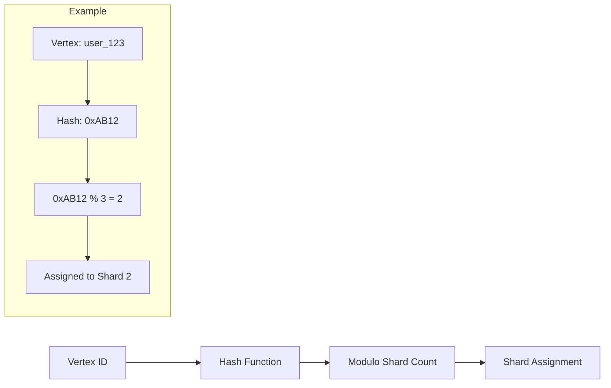

We use consistent hashing with virtual nodes to:
- Minimize data movement when adding/removing nodes
- Ensure even distribution across shards
- Support efficient range queries

#### Kuzu Integration

Each node embeds a Kuzu database instance:

```go
// Kuzu integration (conceptual)
type ShardStorage struct {
    db        *kuzu.Database      // Embedded Kuzu instance
    shardID   int                 // This shard's ID
    vertices  *kuzu.VertexTable   // Local vertices
    edges     *kuzu.EdgeTable     // Local edges
    indexes   map[string]*Index   // Local indexes
}

// Execute local graph query
func (s *ShardStorage) ExecuteLocal(query GraphQuery) (*ResultSet, error) {
    // Transform to Cypher
    cypher := query.ToCypher()
    
    // Execute in Kuzu
    result := s.db.Execute(cypher)
    
    // Return results
    return s.transformResults(result), nil
}
```

### Node Lifecycle

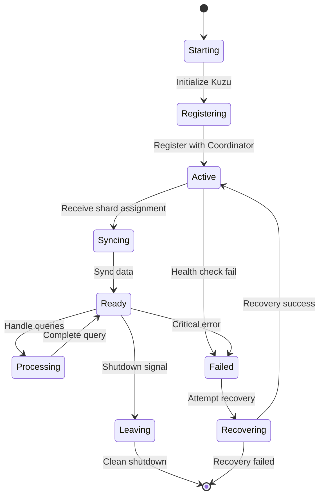

### Data Storage Layout

```
/data/node-{id}/
├── kuzu/               # Kuzu database files
│   ├── catalog/        # Schema information
│   ├── data/           # Graph data files
│   └── wal/            # Write-ahead log
├── metadata/           # Node metadata
│   ├── shard-info.json # Shard assignments
│   └── replica.json    # Replica information
├── cache/              # Query cache
└── logs/               # Node logs
```

## Communication Protocol

### Message Types

#### 1. Control Messages
Used for cluster coordination and management:

```json
{
  "type": "control",
  "operation": "rebalance|shutdown|update_schema|compact",
  "params": {...},
  "timestamp": "2024-01-15T10:30:00Z",
  "version": 1
}
```

#### 2. Query Messages
Used for distributed query execution:

```json
{
  "type": "query",
  "query_id": "q-123456",
  "operation": "traverse|match|aggregate",
  "cypher": "MATCH (n:Person)-[:KNOWS]->(m) RETURN n, m",
  "shard_hint": [1, 2, 3],
  "timeout_ms": 5000
}
```

#### 3. Replication Messages
Used for data synchronization:

```json
{
  "type": "replication",
  "operation": "sync|snapshot|incremental",
  "shard_id": 1,
  "from_version": 100,
  "to_version": 150,
  "data": {...}
}
```

### Protocol Flow

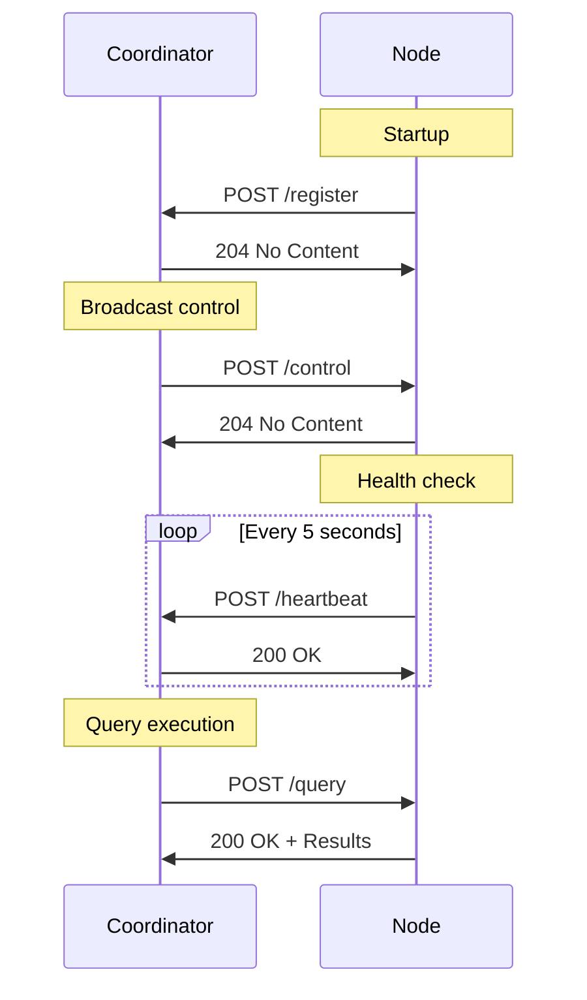

## Data Distribution Strategy

### Sharding Strategy

#### Vertex Distribution
Vertices are distributed using consistent hashing on vertex ID:

```python
def get_shard(vertex_id, num_shards):
    # Use consistent hashing for even distribution
    hash_value = hash(vertex_id)
    
    # Virtual nodes for better distribution
    virtual_node = (hash_value % 100) * num_shards // 100
    
    return virtual_node
```

#### Edge Locality
Edges are stored with their source vertex to maintain locality:
- Outgoing edges: Stored with source vertex
- Incoming edges: Optionally replicated with target vertex
- This minimizes network calls during traversals

#### Property Storage
Properties are co-located with their associated vertices/edges:
- Vertex properties: Same shard as vertex
- Edge properties: Same shard as edge

### Replication Strategy

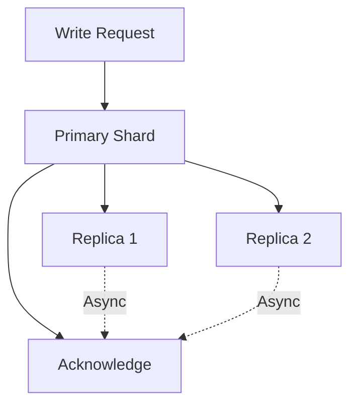

#### Replication Modes

1. **Synchronous Replication**
   - Write to primary and wait for N replicas
   - Higher consistency, lower performance
   - Used for critical data

2. **Asynchronous Replication**
   - Write to primary, replicate in background
   - Higher performance, eventual consistency
   - Default mode

3. **Quorum-Based Replication**
   - Write to majority of replicas
   - Balance between consistency and performance
   - Used for configurable consistency

### Data Balancing

The system automatically rebalances data when:
- New nodes join the cluster
- Nodes leave or fail
- Shard sizes become imbalanced
- Manual rebalancing is triggered

```go
// Rebalancing logic (conceptual)
func (c *Coordinator) rebalanceShards() {
    shardSizes := c.calculateShardSizes()
    avgSize := c.calculateAverageSize()
    
    for shard, size := range shardSizes {
        if size > avgSize * 1.2 {  // 20% over average
            c.splitShard(shard)
        } else if size < avgSize * 0.5 {  // 50% under average
            c.mergeShards(shard, c.findMergeCandidate(shard))
        }
    }
}
```

## Query Execution Model

### Query Planning

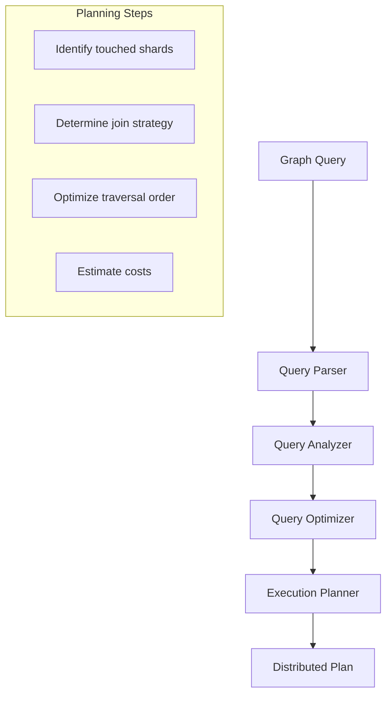

### Execution Strategies

#### 1. Scatter-Gather
For queries that touch multiple shards:
```python
# Pseudo-code
def scatter_gather_query(query):
    # Scatter phase
    subqueries = split_query_by_shard(query)
    futures = []
    for shard, subquery in subqueries:
        futures.append(send_to_shard(shard, subquery))
    
    # Gather phase
    results = []
    for future in futures:
        results.append(await future)
    
    # Merge results
    return merge_results(results)
```

#### 2. Directed Routing
For queries with known shard targets:
```python
def directed_query(query, vertex_id):
    shard = get_shard_for_vertex(vertex_id)
    result = send_to_shard(shard, query)
    return result
```

#### 3. Broadcast
For queries that need all shards:
```python
def broadcast_query(query):
    results = broadcast_to_all_shards(query)
    return aggregate_results(results)
```

### Query Optimization

The system optimizes queries through:

1. **Predicate Pushdown**: Filter early at shard level
2. **Projection Pruning**: Only fetch needed properties
3. **Join Reordering**: Optimize join order based on cardinality
4. **Index Usage**: Leverage local indexes when available
5. **Result Caching**: Cache frequent query results

### Distributed Traversals

Graph traversals across shards require special handling:

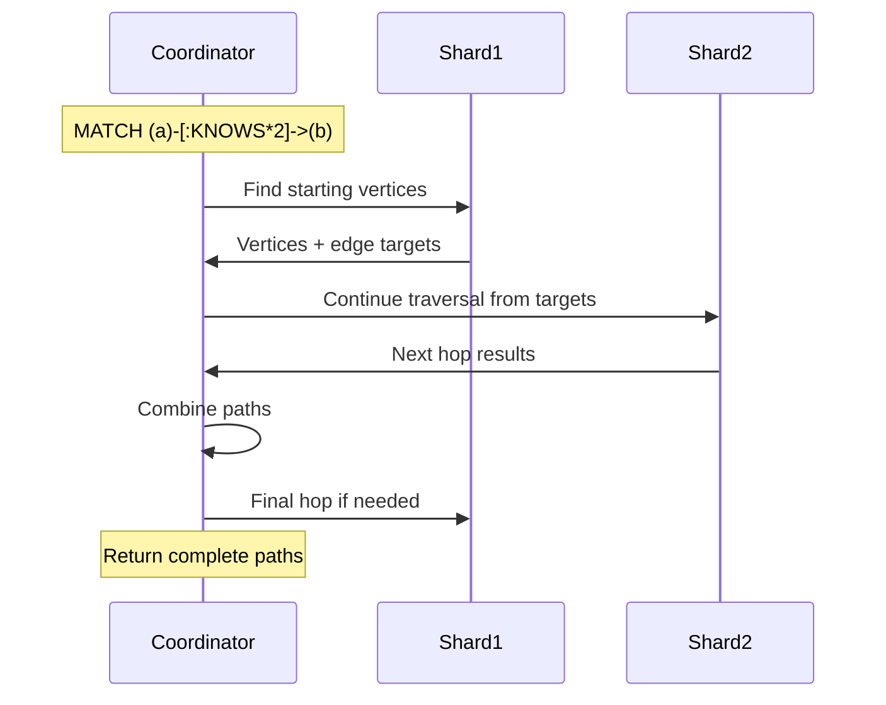

## Fault Tolerance & Recovery

### Failure Detection

```go
// Health check mechanism
type HealthChecker struct {
    interval    time.Duration
    timeout     time.Duration
    maxRetries  int
}

func (h *HealthChecker) checkNode(node *Node) error {
    for i := 0; i < h.maxRetries; i++ {
        ctx, cancel := context.WithTimeout(context.Background(), h.timeout)
        err := node.HealthCheck(ctx)
        cancel()
        
        if err == nil {
            return nil
        }
        
        time.Sleep(time.Second * time.Duration(i+1))  // Exponential backoff
    }
    
    return fmt.Errorf("node %s failed health check", node.ID)
}
```

### Failure Scenarios

#### 1. Node Failure
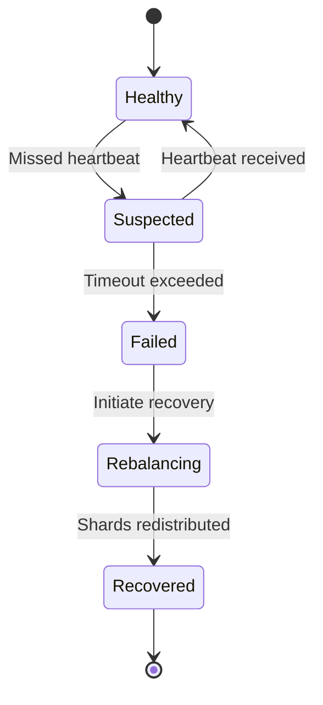

Recovery steps:
1. Detect failure via heartbeat timeout
2. Mark node as failed
3. Promote replicas to primary
4. Initiate shard rebalancing
5. Create new replicas on healthy nodes

#### 2. Network Partition
Handle split-brain scenarios:
- Minority partition: Nodes go read-only
- Majority partition: Continue operating
- Healing: Resync when partition heals

#### 3. Coordinator Failure
For coordinator high availability:
- Run multiple coordinator instances
- Use consensus (Raft) for leader election
- Shared state in external store (etcd/consul)

### Data Recovery

#### Replica Promotion
```python
def promote_replica(failed_shard, replicas):
    # Select best replica (most recent, least loaded)
    best_replica = select_best_replica(replicas)
    
    # Promote to primary
    best_replica.role = "primary"
    
    # Sync with other replicas
    for replica in replicas:
        if replica != best_replica:
            replica.sync_from(best_replica)
    
    # Update routing table
    update_shard_routing(failed_shard, best_replica)
```

#### Data Repair
Continuous background process to ensure data consistency:
- Merkle tree comparison between replicas
- Repair divergent data
- Verify replica counts

## Scaling Strategy

### Horizontal Scaling

#### Adding Nodes
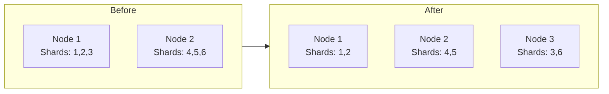

Process:
1. New node registers with coordinator
2. Coordinator calculates new shard distribution
3. Initiate shard migration
4. Update routing tables
5. Verify data integrity

#### Removing Nodes
1. Mark node for decommission
2. Migrate shards to remaining nodes
3. Verify all data transferred
4. Remove node from cluster
5. Rebalance if needed

### Vertical Scaling

Nodes can be vertically scaled by:
- Increasing memory for larger Kuzu cache
- Adding CPU cores for parallel query execution
- Expanding storage for more graph data

### Auto-Scaling

```python
# Auto-scaling logic (conceptual)
def auto_scale_cluster():
    metrics = collect_cluster_metrics()
    
    # Scale up conditions
    if metrics.avg_cpu > 80 or metrics.avg_memory > 85:
        add_nodes(calculate_nodes_needed(metrics))
    
    # Scale down conditions
    elif metrics.avg_cpu < 20 and metrics.avg_memory < 30:
        remove_nodes(calculate_nodes_to_remove(metrics))
    
    # Rebalance after scaling
    rebalance_cluster()
```

### Capacity Planning

Key metrics for capacity planning:
- **Vertices per shard**: Target 1-10 million
- **Edges per shard**: Target 10-100 million  
- **Query latency**: P99 < 100ms
- **Throughput**: 10K+ queries/second/node

## Implementation Roadmap

### Phase 1: Foundation ✅
- Basic coordinator-node communication
- Registration and discovery
- Health monitoring
- Control message broadcasting

### Phase 2: Kuzu Integration (Current)
```
Tasks:
1. Integrate Kuzu into node storage layer
2. Implement basic graph operations (CREATE, MATCH, DELETE)
3. Design shard assignment algorithm
4. Build query routing mechanism
```

### Phase 3: Distributed Queries
```
Tasks:
1. Query parser and planner
2. Distributed execution engine
3. Result aggregation framework
4. Query optimization rules
```

### Phase 4: Replication & Recovery
```
Tasks:
1. Replica management
2. Failure detection and handling
3. Automatic failover
4. Data repair mechanisms
```

### Phase 5: Performance & Operations
```
Tasks:
1. Query caching layer
2. Monitoring and metrics
3. Admin CLI tools
4. Performance benchmarks
```

### Phase 6: RAG Integration
```
Tasks:
1. Vector embedding support
2. Semantic search capabilities
3. LLM integration points
4. Context retrieval optimization
```

## Performance Considerations

### Optimization Strategies

1. **Connection Pooling**: Reuse HTTP connections between components
2. **Batch Operations**: Group multiple operations into single requests
3. **Compression**: Compress large payloads in transit
4. **Caching**: Multi-level caching (query, result, metadata)
5. **Index Optimization**: Strategic index placement

### Benchmarking Targets

| Metric | Target | Current | Notes |
|--------|--------|---------|-------|
| Node Registration | < 100ms | ~50ms | ✅ |
| Health Check | < 10ms | ~5ms | ✅ |
| Simple Query | < 50ms | TBD | Pending Kuzu |
| Complex Traversal | < 500ms | TBD | Pending implementation |
| Throughput | 10K QPS | TBD | Per node |
| Data Ingestion | 100K vertices/sec | TBD | Per cluster |

## Security Considerations

### Current State
- No authentication/authorization (development phase)
- HTTP communication (no TLS)
- Trust-based node registration

### Production Requirements
1. **Authentication**: mTLS between components
2. **Authorization**: Role-based access control
3. **Encryption**: Data at rest and in transit
4. **Audit Logging**: All operations logged
5. **Network Isolation**: Private network for cluster

## Monitoring & Observability

### Metrics to Track

#### Cluster Metrics
- Node count and status
- Shard distribution
- Replication lag
- Cluster version

#### Performance Metrics  
- Query latency (P50, P95, P99)
- Throughput (QPS)
- Cache hit rates
- Network bandwidth

#### Resource Metrics
- CPU utilization
- Memory usage
- Disk I/O
- Network I/O

### Logging Strategy

```go
// Structured logging approach
log.WithFields(log.Fields{
    "component": "coordinator",
    "operation": "query_planning",
    "query_id":  queryID,
    "duration":  duration,
    "shard_count": len(shards),
}).Info("Query planned successfully")
```

### Health Monitoring

```json
// Comprehensive health endpoint response
{
  "status": "healthy",
  "version": "0.1.0",
  "uptime": 3600,
  "cluster": {
    "nodes": 3,
    "shards": 12,
    "replicas": 24
  },
  "metrics": {
    "qps": 1523,
    "latency_p99": 45,
    "cache_hit_rate": 0.85
  }
}
```

## Conclusion

Torua's architecture prioritizes simplicity, scalability, and reliability. By combining Elasticsearch's proven clustering model with Kuzu's powerful graph capabilities, we create a system uniquely suited for distributed GraphRAG workloads.

The modular design allows for incremental development while maintaining a clear path to production readiness. Each component has well-defined responsibilities and interfaces, making the system easy to understand, extend, and operate.

As we progress through the implementation phases, this architecture will evolve based on real-world requirements and performance characteristics, always maintaining our core principle: **simple, distributed, graph-native**.